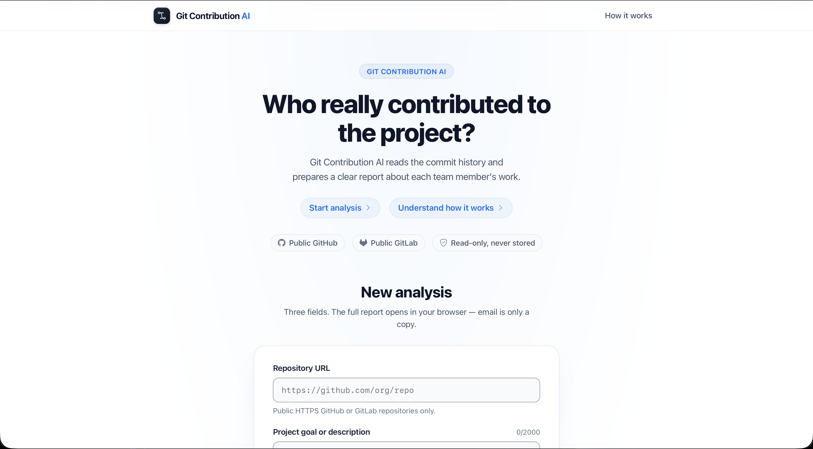
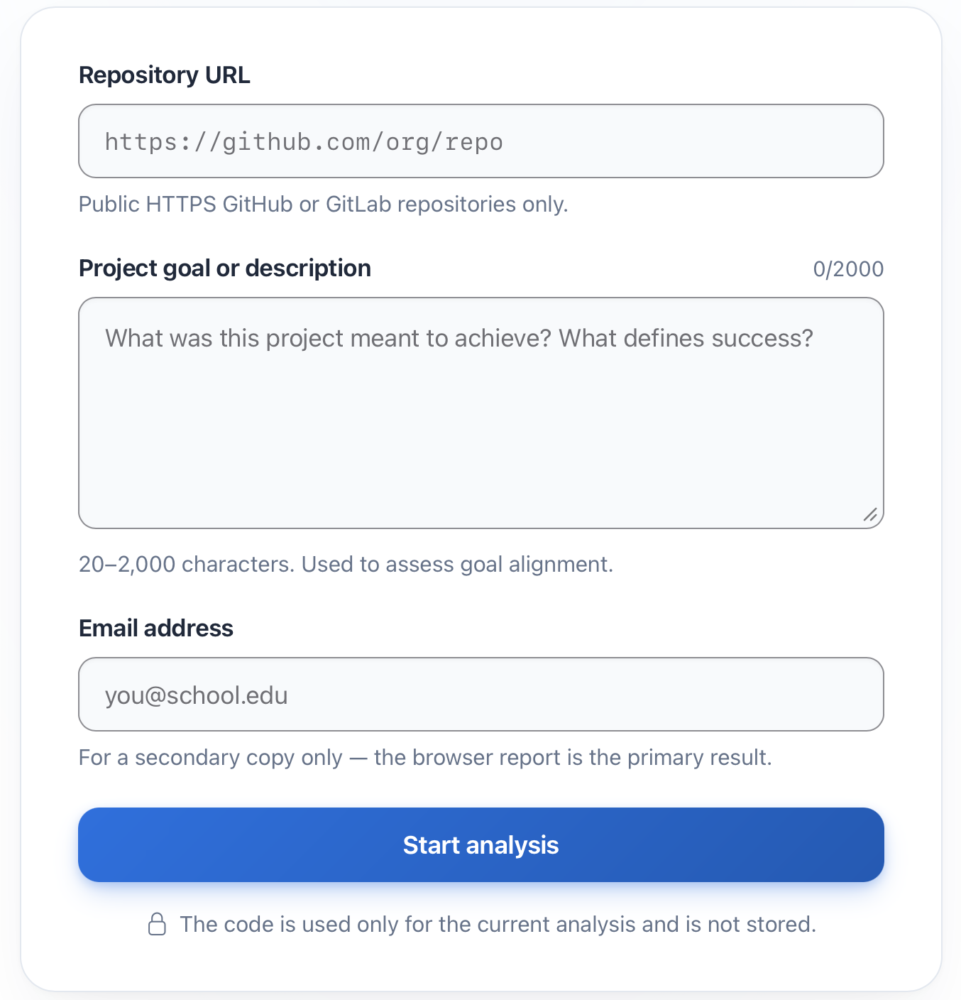
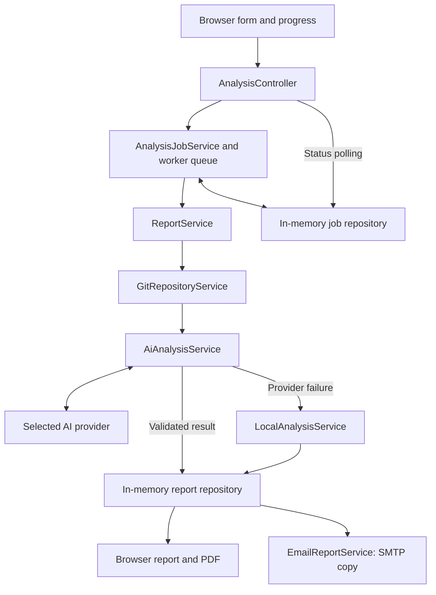

# Git Contribution AI

Git Contribution AI is a Spring Boot web application that turns the Git history of a public GitHub or GitLab repository into a contribution report. It combines commit metadata, changed files, diffs, and a project goal to describe each contributor's work, classify commits, and estimate relative contribution shares.

The user selects an AI provider and model and supplies a key for that analysis. If the provider cannot produce a valid result, a deterministic local analyzer completes the report. Results are available in the browser, as an A4 PDF, and as an HTML email copy when SMTP delivery succeeds.

The application runs without a database or a frontend build step. Jobs and reports are held in memory. Generated reports remain available in the running process; download a PDF to keep a copy after restart.

## Contents

- [Features](#features)
- [Screens](#screens)
- [Setup and running](#setup-and-running)
- [Configuration](#configuration)
- [Using the application](#using-the-application)
- [Analysis workflow](#analysis-workflow)
- [Reports and email delivery](#reports-and-email-delivery)
- [Technology and architecture](#technology-and-architecture)
- [Routes](#routes)
- [Testing and previews](#testing-and-previews)
- [Troubleshooting](#troubleshooting)
- [Data handling and limitations](#data-handling-and-limitations)
- [Further documentation](#further-documentation)

## Features

- Public HTTPS GitHub and GitLab repository analysis, with configurable commit and diff limits.
- A provider/model selector with **66 configured models across 11 AI providers**, including **11 OpenAI** and **11 Anthropic Claude** models, using a key supplied through the form.
- Structured AI output validation, including complete commit coverage, consistent category counts, and contribution percentages totaling 100%.
- Automatic local fallback with a visible explanation of why AI analysis was unavailable.
- Background analysis with a live progress page, a circular progress indicator, nine pipeline stages, and replay of reached milestones.
- Contributor ranking, category breakdowns, commit evidence, importance scores, team indicators, and an explicit analysis methodology.
- Separate **Open PDF** and **Download PDF** actions, with a dedicated A4 layout and an embedded font supporting Cyrillic text.
- Email delivery enabled by default, with SMTP settings loaded from an optional `.env` file or process environment variables.
- Responsive layouts, visible form controls, accessible validation and progress states, and animations that respect reduced-motion preferences.

## Screens

Screenshots from the application UI. The form uses example inputs; progress, report, and PDF views use the [local design previews](#local-design-previews). The report preview deliberately shows a failed email-copy notification. Click an image to view it at full resolution.

<table>
  <tr>
    <td width="50%" valign="top">
      <p><strong>Home page</strong> — introduction and analysis entry point.</p>
      <a href="pics/home.png"></a>
    </td>
    <td width="50%" valign="top">
      <p><strong>Analysis form</strong> — repository, project goal, model, API key, and email.</p>
      <a href="pics/input.png"></a>
    </td>
  </tr>
  <tr>
    <td width="50%" valign="top">
      <p><strong>Analysis in progress</strong> — circular progress and the nine-stage pipeline.</p>
      <a href="pics/Analysis%20screen.png"></a>
    </td>
    <td width="50%" valign="top">
      <p><strong>Completed analysis</strong> — 100% progress with local fallback skipped.</p>
      <a href="pics/analysis%20screen%20complete.png"></a>
    </td>
  </tr>
  <tr>
    <td width="50%" valign="top">
      <p><strong>Report overview</strong> — PDF actions, delivery status, goal alignment, and contribution shares.</p>
      <a href="pics/report%20screen.png"></a>
    </td>
    <td width="50%" valign="top">
      <p><strong>Contributor details</strong> — contribution levels, main work, and category breakdowns.</p>
      <a href="pics/report%20screen%202.png"></a>
    </td>
  </tr>
  <tr>
    <td width="50%" valign="top">
      <p><strong>Evidence and assessment</strong> — expanded commits, importance scores, and methodology.</p>
      <a href="pics/report%20screen%203.png"></a>
    </td>
    <td width="50%" valign="top">
      <p><strong>PDF report</strong> — first page of the generated A4 document.</p>
      <a href="pics/report%20pdf.png"></a>
    </td>
  </tr>
</table>

## Setup and running

### Requirements

| Requirement | Purpose |
|---|---|
| JDK 21 | The project compiles for Java 21. |
| Maven 3.9+ | Builds and runs the application; no Maven wrapper is included. |
| Git CLI on `PATH` | Clones repositories and reads commit history. |
| A browser with JavaScript enabled | Displays the form, live progress, and reports. |
| Network access | Required for repository cloning, AI requests, and SMTP delivery. |
| An API key for the selected AI provider | Entered through the form for each analysis. |
| SMTP account credentials | Required to deliver email; the browser report and PDF work without them. |

Open a terminal in the project root, where `pom.xml` is located. Check the tools, including the JDK Maven actually uses:

```bash
java -version
mvn -version
git --version
```

### Start from source

For a new checkout, create the local configuration file:

```bash
cp .env.example .env
```

Keep an existing `.env` instead of overwriting it. The leading dot makes this a hidden file on many systems. Fill in the SMTP credentials described below, then start the application from the project root:

```bash
mvn spring-boot:run
```

Open [http://localhost:8080](http://localhost:8080). Stop the application with `Ctrl+C`.

The `.env` file is optional: the app can start without it. With the default configuration, a report will show a missing-SMTP-settings notice if email credentials have not been supplied.

### Build and run a JAR

```bash
mvn clean package
java -jar target/git-contribution-ai-0.0.1-SNAPSHOT.jar
```

The package command runs the tests and creates an executable JAR. Run the JAR from the directory containing your `.env`, or provide configuration through process environment variables.

## Configuration

### Local configuration file

[application.properties](src/main/resources/application.properties) imports `.env` from the application's working directory using [Spring Boot configuration import](https://docs.spring.io/spring-boot/reference/features/external-config.html):

```properties
spring.config.import=optional:file:.env[.properties]
```

[.env.example](.env.example) contains the supported local settings with empty credential values:

```properties
MAX_COMMITS=80
MAX_DIFF_CHARS=6000
GIT_TIMEOUT_SECONDS=120
AI_TIMEOUT_SECONDS=180

MAIL_ENABLED=true
MAIL_HOST=smtp.gmail.com
MAIL_PORT=587
MAIL_USERNAME=
MAIL_PASSWORD=
MAIL_FROM=
```

Use Java properties syntax: `KEY=value`, without `export` or surrounding quotes. A literal backslash must be escaped as `\\`. The real `.env` is ignored by Git; `.env.example` is the shareable template.

For the settings listed here, precedence is **process environment variables → `.env` → application defaults**. Restart the application after changing configuration. In an IDE, set the run configuration's working directory to the project root so the same `.env` is found.

### Processing settings

| Variable | Default | Allowed range | Meaning |
|---|---:|---:|---|
| `MAX_COMMITS` | `80` | `1–200` | Maximum number of commits selected by `git log --all`. |
| `MAX_DIFF_CHARS` | `6000` | `500–20000` | Diff characters retained per commit before adding a truncation notice. |
| `GIT_TIMEOUT_SECONDS` | `120` | `20–600` | Timeout for each Git command, including cloning. |
| `AI_TIMEOUT_SECONDS` | `180` | `30–600` | Read timeout for the selected AI provider. |

The application validates these ranges at startup. The AI client also uses a 20-second connection timeout and a 2 MiB response-size limit. Commit selection limits the analyzed sample; the repository clone still downloads complete Git objects.

### SMTP settings

| Variable | Default | Meaning |
|---|---|---|
| `MAIL_ENABLED` | `true` | Enables email delivery; set `false` to disable it explicitly. |
| `MAIL_HOST` | `smtp.gmail.com` | SMTP server hostname. |
| `MAIL_PORT` | `587` | SMTP server port. |
| `MAIL_USERNAME` | Empty | SMTP account username; required for sending. |
| `MAIL_PASSWORD` | Empty | SMTP account password or app password; required for sending. |
| `MAIL_FROM` | Empty | Sender address; defaults to `MAIL_USERNAME` when blank. |

The defaults enable SMTP authentication and STARTTLS, use UTF-8, and set connection/read/write timeouts to 10 seconds each. For another mail provider, use its SMTP settings and adjust the Spring Mail transport properties if its TLS requirements differ.

For Gmail, enter the full sender email address as `MAIL_USERNAME` and a [Google app password](https://support.google.com/mail/answer/185833?hl=en) as `MAIL_PASSWORD`. Creating an app password requires 2-Step Verification and an account that permits app passwords.

The person running the application configures the **sender's SMTP account**. The address entered in the analysis form is the **recipient**.

### AI credentials

AI keys and models are entered in the browser form. Use `AI_TIMEOUT_SECONDS` for the provider timeout.

A key must belong to the selected provider. For example, a model hosted through OpenRouter requires an OpenRouter key. Changing provider clears the current key; changing models within the same provider preserves it. If server validation rejects a form submission, the key must be entered again.

## Using the application

1. Open the home page and complete all five required fields.
2. Select **Start analysis** to open the progress page.
3. Follow the reached stages while the server reads the repository and creates the report.
4. Review the completed report, its analysis source, and its email-delivery status.
5. Use **Open PDF** or **Download PDF** to save a copy before stopping the application.

| Field | Requirement |
|---|---|
| Repository URL | Public HTTPS repository on `github.com` or `gitlab.com`, up to 300 characters. Use the repository URL without embedded credentials, a query string, or a fragment. |
| Project goal or description | 20–2,000 characters describing the intended functionality and context. |
| AI model | An exact provider/model combination from the selector. |
| AI API key | Required, up to 1,024 characters, with no line breaks. |
| Email address | A valid recipient address. The current form requires this field even when `MAIL_ENABLED=false`. |

A blank AI key or missing model is rejected before a job starts. Local fallback is activated when the selected provider fails during analysis; the form does not offer a separate local-only mode.

### Provider catalog

The browser selector and backend registry contain the following configured choices:

| Provider | Namespace | Model choices |
|---|---|---:|
| Google Gemini | `google` | 5 |
| OpenAI | `openai` | 11 |
| Anthropic Claude | `anthropic` | 11 |
| OpenRouter | `openrouter` | 14 |
| xAI | `xai` | 1 |
| DeepSeek | `deepseek` | 2 |
| Mistral AI | `mistral` | 3 |
| Groq | `groq` | 5 |
| Together AI | `together` | 7 |
| Hugging Face | `huggingface` | 5 |
| Cerebras | `cerebras` | 2 |
| **Total** | **11 providers** | **66** |

These counts describe the application's configured catalog. Availability and account access are determined by each provider. See [AI_PROVIDERS.md](docs/AI_PROVIDERS.md) for the exact model values, endpoint mapping, and provider references.

## Analysis workflow

The controller validates the request and queues it on a background executor. A worker clones the repository into temporary storage, reads a bounded sample using `git log --all`, and collects author names/emails, timestamps, messages, changed-file statistics, and truncated diffs. The default branch is recorded as report metadata; commit selection can include history from other fetched refs.

The selected AI provider receives the project description and collected Git data. The application validates its structured response, then creates and saves the report. It attempts email delivery, records the outcome, and completes the job. Temporary repository data is cleaned up after extraction.

### Progress stages

| Stage | Milestone |
|---|---:|
| `QUEUED` | 0% |
| `STARTING` | 5% |
| `READING_REPOSITORY` | 10% |
| `ANALYZING_WITH_AI` | 55% |
| `LOCAL_FALLBACK` | 70% |
| `PREPARING_REPORT` | 82% |
| `SAVING_REPORT` | 88% |
| `DELIVERING_EMAIL` | 94% |
| `COMPLETED` | 100% |

The browser polls the status API and uses the server's stage history and `PENDING`, `ACTIVE`, `COMPLETE`, and `SKIPPED` states. It animates percentage changes and replays reached stages if several finished between polls. The unused analysis path is shown as skipped.

Percentages represent workflow milestones, so they do not measure downloaded bytes or estimate remaining time. Reduced-motion settings shorten the visual transitions. New submissions replay the opening sequence; reopening an existing progress URL uses its stored state.

### AI validation and fallback

An AI result is accepted only when all required fields and enum values are valid, every selected commit is covered exactly once, category-summary counts match the analyzed commits, and contributor percentages total 100%. Importance scores must be between 1 and 5, and contribution levels must match their percentages.

Rejected credentials, unavailable models, rate limits, timeouts, network/provider errors, blocked or empty responses, and invalid results trigger the deterministic local analyzer. The completed report identifies **Local fallback**, includes a safe reason, and explains the method used. Repository-cloning failures and unexpected application errors instead produce a failed job.

The local analyzer:

1. Classifies commits from messages and file paths into Functional, Bug Fix, Refactoring, Documentation, Formatting, Testing, Configuration, or Other.
2. Assigns importance from changed-line ranges, with a project-keyword adjustment and category-specific caps.
3. Groups commits by normalized author email and sums their importance scores.
4. Converts scores to whole-number contribution shares, distributing remainder points so the total is exactly 100%.

Both analysis paths sort contributors by descending share. Contribution levels are **High: 25–100%**, **Medium: 15–24%**, and **Low: 0–14%**. The local method estimates visible activity and cannot provide semantic code interpretation.

## Reports and email delivery

The report includes repository metadata, the analyzed commit count, project summary and goal alignment, contributor shares and main work, category counts, commit-level evidence, importance explanations, risk notes, team indicators, a conclusion, and methodology. It also identifies the analysis source and engine, generation time, and email-delivery outcome.

PDF generation uses a separate A4 template. **Open PDF** opens it in a new tab; **Download PDF** requests an attachment. Browser reports and PDFs use the same stored analysis.

Email delivery uses an HTML message with an **HTML report attachment**. The PDF is generated through the report actions and is not attached to the email.

| Email status | Meaning |
|---|---|
| `PENDING` | The report is saved and delivery has not yet completed. |
| `SENT` | The mail sender completed the SMTP send operation. |
| `DISABLED` | `MAIL_ENABLED=false` explicitly disabled sending. |
| `FAILED` | SMTP settings are incomplete or delivery failed. |

The report is saved **before** the email attempt, and its delivery status is saved afterward. Disabled or failed email delivery does not discard the report or prevent PDF export. SMTP acceptance does not guarantee inbox placement; check spam filtering when a report is marked sent. Existing reports retain their delivery status; changing SMTP configuration does not resend them automatically.

## Technology and architecture

| Component | Implementation |
|---|---|
| Language and build | Java 21 target, Maven, Spring Boot **4.1.0** |
| Web layer | Spring MVC, Thymeleaf templates, CSS and JavaScript |
| Validation | Jakarta Bean Validation, Hibernate Validator, typed records and enums |
| Git extraction | Git CLI through `ProcessBuilder`, with timeouts and temporary-file cleanup |
| AI transport | Spring `RestClient`, JDK HTTP client, Jackson, fixed Chat Completions endpoints |
| Email | Spring Mail auto-configuration, `MailProperties`, injected `JavaMailSender` |
| PDF | OpenHTMLtoPDF **1.1.73** with a PDFBox backend and dedicated Thymeleaf template |
| Background work | `ThreadPoolTaskExecutor`: 2 workers and a queue capacity of 20 |
| Storage | Concurrent in-memory repositories for jobs and reports |
| Tests | JUnit, AssertJ, Mockito, Spring test support, and MockMvc |



### Project structure

```text
.
├── .env.example                     # SMTP and processing configuration template
├── pom.xml
├── README.md
├── docs/                            # Architecture, provider contract, project history
├── pics/                            # README screenshots
└── src/
    ├── main/
    │   ├── java/mk/ukim/finki/gitcontributor/
    │   │   ├── config/              # Validated settings and worker executor
    │   │   ├── dto/                 # Immutable request, status, and analysis DTOs
    │   │   ├── enums/               # Provider registry, stages, categories, statuses
    │   │   ├── exception/           # Controlled repository, provider, and report errors
    │   │   ├── model/               # Git facts, provider selection, jobs, reports
    │   │   ├── repository/          # In-memory storage and repository interfaces
    │   │   ├── service/impl/        # Service implementations; interfaces in service/
    │   │   ├── validation/          # Supported provider/model validation
    │   │   ├── web/                 # MVC controller and local error handling
    │   │   └── GitContributionApplication.java
    │   └── resources/
    │       ├── application.properties
    │       ├── application-test.properties
    │       ├── static/              # Shared assets and dedicated progress stylesheet
    │       └── templates/           # Browser, email, PDF, and shared fragments
    └── test/                        # Automated tests, fixtures, and preview controller
```

## Routes

| Method | Path | Result |
|---|---|---|
| `GET` | `/` | Analysis form. |
| `POST` | `/analyze` | Validates input and redirects to the new analysis. |
| `GET` | `/analyses/{id}` | Progress page for a stored job. |
| `GET` | `/api/analyses/{id}` | JSON status, stage history/states, and report URL when complete. |
| `GET` | `/reports/{id}` | Stored browser report. |
| `GET` | `/reports/{id}/pdf` | PDF displayed inline. |
| `GET` | `/reports/{id}/pdf?download=true` | PDF downloaded as an attachment. |

Identifiers are UUIDs. Missing jobs/reports return controlled errors. Form POST responses, status JSON, and PDF responses use `Cache-Control: no-store`.

## Testing and previews

### Automated checks

```bash
mvn test
```

There are **180 test invocations across 22 test classes**, with **0 failures, 0 errors, and 0 skipped tests**. Coverage includes configuration binding, `.env` import and environment precedence, default-on email and explicit disabling, Git extraction, parity between all 66 picker and backend model values, submission of every newly added OpenAI/Anthropic model, response validation, local scoring, job lifecycle and capacity, controller behavior, PDF generation, and report preservation when email fails.

Tests use mocks and synthetic data; they do not call live AI providers, clone remote repositories, or send real email. A successful run ends with `BUILD SUCCESS`; detailed results are written to `target/surefire-reports/`.

To rerun the SMTP/configuration checks:

```bash
mvn -Dtest=AppSettingsTest,MailConfigurationTest,EmailReportServiceImplTest,ReportServiceImplTest test
```

Optional JavaScript syntax checks require Node.js, which is not needed to run the application:

```bash
node --check src/main/resources/static/js/app.js
node --check src/main/resources/static/js/design-preview.js
```

### Local design previews

Start with the test classpath and test profile to inspect synthetic report/progress states without creating a real analysis:

```bash
mvn spring-boot:test-run -Dspring-boot.run.profiles=test
```

Then open [the report preview](http://localhost:8080/__preview/report), [the PDF preview](http://localhost:8080/__preview/report/pdf), or [the progress preview](http://localhost:8080/__preview/progress?stage=ANALYZING_WITH_AI). A [completed fallback preview](http://localhost:8080/__preview/progress?stage=COMPLETED&source=LOCAL_FALLBACK) is also available.

These preview routes come from the test-only `DesignPreviewController` and are absent from the packaged application. Submitting the normal home-page form still starts a real analysis.

## Troubleshooting

| Symptom | What to check |
|---|---|
| Application does not start | Check `mvn -version`, dependency resolution, and processing values against the allowed ranges. Port 8080 must be available. |
| `.env` settings appear to have no effect | Check the working directory, Java properties syntax, and any overriding process environment variables. Restart after editing the file. |
| Form asks for an AI key again | All five fields are required. After server validation fails, the password field is deliberately cleared. |
| Report uses Local fallback | Read the report's reason; check provider/key compatibility, model access, quota, and timeouts. An empty key is rejected by the form before this stage. |
| Repository cannot be analyzed | Use a public repository URL on GitHub or GitLab. Check Git availability, connectivity, and the Git timeout. Reducing `MAX_COMMITS` does not reduce the complete clone download. |
| Analysis cannot start because the server is busy | The executor has 2 workers and room for 20 queued tasks. Wait for running work to finish and retry. |
| Email delivery is disabled | Check for `MAIL_ENABLED=false` in `.env` or the process environment, or an explicit `app.mail-enabled` override. The default is `true`. |
| SMTP settings are missing | Configure `MAIL_USERNAME` and `MAIL_PASSWORD`; also check `MAIL_HOST` and the sender address. The recipient field does not configure the SMTP account. |
| SMTP delivery failed or a sent email is missing | Verify credentials, host, port, TLS settings, and sender permissions. For Gmail, check the app password; if the status is `SENT`, also check spam filtering. |
| Progress remains at 94% briefly | The worker is attempting email delivery; configured mail timeouts bound individual network operations. |
| A report URL stops working after restart | Jobs and reports are in memory. Start a new analysis and download its PDF before stopping the app. |

## Data handling and limitations

- The selected AI provider receives the project description and collected Git facts, including author names/emails, messages, changed-file statistics, and bounded diffs. Provider calls can consume account quota.
- The submitted AI key is used for the queued/running analysis and is not copied into stored job/report records, status JSON, PDFs, email, or browser storage. It is not repopulated after a validation error. SMTP credentials belong in the Git-ignored `.env` or the process environment.
- Repository content is treated as untrusted data in the AI prompt, and dynamic report content is escaped by Thymeleaf. Git commands use argument lists through `ProcessBuilder`.
- The app supports public repositories on `github.com` and `gitlab.com`. Private repositories, self-hosted Git services, arbitrary AI endpoints, Azure deployment settings, and local AI servers are not configurable through the form.
- There is no database, sign-in, or per-user report access control. The application is designed as a local academic/demo project; anyone with access to the server and a report URL can open that report.
- The job registry targets 200 recent entries by evicting the oldest terminal jobs. Active jobs are retained. Completed reports have no automatic expiry during the running process, and all jobs/reports disappear on restart.
- Contribution shares cover the selected Git sample. Author email is an imperfect identity, and Git history does not capture every form of teamwork. AI estimates and local heuristics require human interpretation when assessing contributions.

## Further documentation

| Document | Contents |
|---|---|
| [Architecture](docs/ARCHITECTURE.md) | Service boundaries, request/credential lifecycle, provider transport, and storage. |
| [AI providers](docs/AI_PROVIDERS.md) | Configured model values, fixed endpoints, credential rules, and provider references. |