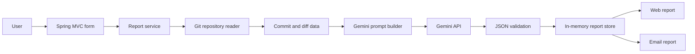

# System Architecture

## Main idea

The application separates objective Git facts from the contribution assessment. The Git layer collects repository data, and Gemini AI interprets that data in relation to the project goal.

## Responsibilities

- The web layer validates input and renders the form and reports.
- The Git layer accepts public GitHub/GitLab HTTPS URLs, clones them temporarily, and extracts commits, files, and diffs.
- The Gemini layer builds a controlled prompt, calls the API, parses JSON, and validates completeness.
- The report layer stores results in memory and optionally sends them through SMTP.

## Data and privacy

Repository content exists only in a temporary directory and is removed after extraction. Reports are kept in memory and disappear when the application restarts. Secrets are read from the local `.env` file and are not committed to Git.