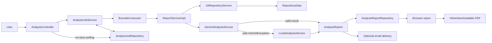
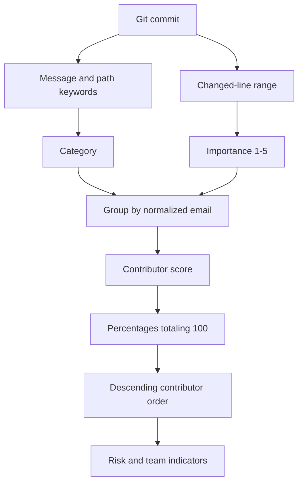
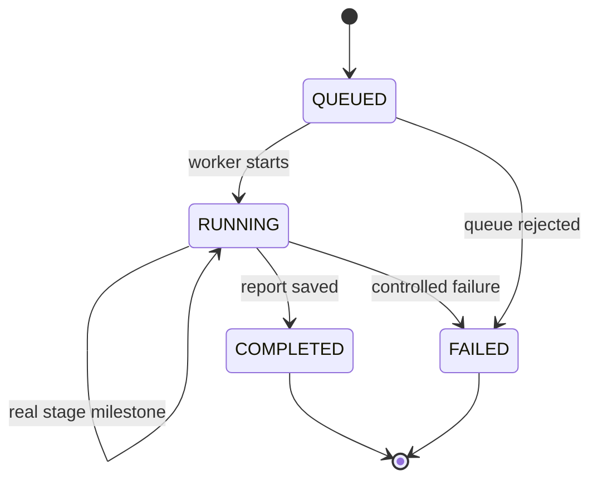

# System Architecture

## Main idea

The application separates request handling, background execution, Git data collection, contribution interpretation, report storage, and optional delivery. Gemini is the primary analysis engine. A deterministic analyzer provides a clearly labeled fallback when Gemini cannot return a usable analysis. The completed report is always prepared for the browser; email is an optional second delivery channel.

The POST request returns quickly with an analysis URL. A worker performs the long-running operation, while the browser polls a small status endpoint and renders real server milestones from 0% to 100%.

## Package responsibilities

### `web`

- validates and receives the analysis form;
- redirects new submissions to the analysis progress URL with a one-time queued-first presentation signal;
- returns a privacy-safe, non-cacheable job status response;
- keeps the actual job immutable while rendering a queued presentation snapshot for a new analysis, then lets the browser replay its real stage history;
- renders completed jobs at 100% so the browser can hold the success frame for 1.6 seconds (1.2 seconds with reduced motion) before opening the stored report;
- exposes the stored report as a non-cacheable inline or downloadable PDF;
- renders controlled error pages;
- lets Spring bind UUID and boolean route values directly, while a controller-local type-mismatch handler preserves the route-specific HTML, JSON, and PDF failure responses without restoring a global handler.

### `service` and `service/impl`

- `AnalysisJobServiceImpl` receives an immutable `AnalysisRequestDto`, submits it to the bounded executor, advances its lifecycle, and converts internal failures to safe browser messages;
- `GitRepositoryServiceImpl` validates URLs, performs a complete clone, extracts commits and changed-file objects, and removes temporary files;
- `AiPromptBuilder` converts the project goal and Git records into a controlled prompt;
- `AiAnalysisServiceImpl` calls Gemini, applies Jakarta Bean Validation to its structured response, retains the cross-field/domain checks, and maps provider failures to stable internal reasons;
- `LocalCommitClassifier` applies deterministic commit categories and importance rules;
- `LocalAnalysisServiceImpl` groups commits, calculates local percentages, and creates indicators;
- `ReportServiceImpl` selects Gemini first, catches only `GeminiException` for fallback, saves the report for the browser, and then attempts optional email delivery;
- `EmailReportServiceImpl` renders and sends the completed report through Spring's injected `JavaMailSender` when SMTP delivery is enabled.
- `ReportPdfServiceImpl` renders a dedicated A4 Thymeleaf document through OpenHTMLtoPDF with an embedded Unicode-capable font.

### `repository`

- `AnalysisJobRepository` separates job lifecycle storage from background execution;
- `AnalysisReportRepository` separates completed report storage from orchestration;
- the in-memory implementations use concurrent maps and keep the student version infrastructure-free;
- the job registry keeps up to 200 recent records by evicting the oldest terminal jobs, while completed reports remain in their separate process-local repository.

### `dto` and `model`

- immutable DTO records represent form data, analysis data, and the public job status;
- `ContributionAnalysisDto` establishes one canonical contributor order: contribution percentage descending, then name and email for deterministic ties;
- model records represent Git facts, reports, typed email-delivery state, and jobs;
- `AnalysisJobStatusDto.from(...)` exposes typed job status and stage values, which Jackson serializes to the same uppercase strings expected by the polling client.

### `enums`

All closed domains are centralized in `mk.ukim.finki.gitcontributor.enums`; free-form explanatory text remains a `String`.

| Enum | Contract |
|---|---|
| `CommitCategory` | Eight commit classifications shared by Gemini and the local classifier |
| `ContributionLevel` | `HIGH`, `MEDIUM`, and `LOW`; `fromPercentage(int)` enforces the 25/15 thresholds and `displayName()` preserves title-case output |
| `TeamIndicatorSeverity` | `INFO`, `WARNING`, and `CRITICAL`; `cssClass()` preserves lowercase report styles |
| `AnalysisSource` | Gemini or local fallback; `displayName()` preserves the report/email labels |
| `EmailDeliveryStatus` | Pending, disabled, sent, or failed; `cssClass()` preserves delivery-note styling |
| `AiFailureCategory` | Broad, stable grouping of provider failure reasons |
| `AiFailureReason` | Concrete safe fallback reason with `category()` and `userMessage()` metadata |
| `AnalysisJobStatus` | Queued/running/completed/failed job lifecycle |
| `AnalysisStage` | Stage percentage, label, and privacy-safe message returned by `progress()`, `label()`, and `message()` |
| `AnalysisStageState` | Pending/active/complete/skipped checklist state published for every stage |

The first five enums replace formerly repeated string domains. The last four centralize already typed diagnostics and progress lifecycle values that previously lived under `exception` or `model`.

### `config`

- `spring.config.import=optional:file:.env[.properties]` lets Spring load a local `.env` file when one exists; values follow `.properties` syntax and are therefore kept unquoted;
- the validated `AppSettings` `@ConfigurationProperties(prefix = "app")` record binds processing, Gemini, and mail feature settings, while `application.properties` owns their defaults, including `gemini-3.6-flash`;
- Spring's `spring.mail.*` auto-configuration binds SMTP values and supplies the shared `MailProperties` and `JavaMailSender` instances;
- `AnalysisTaskConfig` supplies a dedicated executor with 2 workers and a queue capacity of 20 jobs; in-memory work is not kept alive when that executor is destroyed.

## Reliable Git extraction

The changed-file analysis needs commit, tree, and blob objects. A partial clone can advertise a commit in Git's commit graph while the required object is absent locally, producing errors such as “in the commit graph file but not in the object database.” The application therefore performs a complete clone instead of using `--filter=blob:none`. Processing limits still constrain the amount of history and diff text sent for analysis; they do not deliberately omit objects needed to read the selected commits.

Temporary clones are removed after extraction, including failed attempts. A Git timeout or worker interruption force-stops the root process and its snapshotted descendants so helpers such as `git-remote-https` do not continue after the in-memory job has ended.

## Gemini boundary and safe fallback diagnostics

Fallback activates only for `GeminiException`. Stable reasons distinguish configuration, request, authentication, capacity, connectivity, provider, and response failures. Examples include a missing key or model, rejected credentials, an unavailable model, quota limits, timeouts, network failures, blocked output, and invalid structured output.

HTTP status codes and transport failures are mapped to those reasons. `GeminiPromptBuilder.build(...)` derives its category, contribution-level, and severity alternatives directly from the enum constants through `enumNames(...)`. The provider is therefore asked for the same uppercase names that Jackson must deserialize.

`GeminiAnalysisServiceImpl.parseResponse(...)` converts unknown enum values into the controlled `INVALID_RESPONSE` reason. Jakarta Bean Validation on the nested DTO records enforces required text, list, range, hash, category, level, and severity structure. `validateResponse(...)` still performs the semantic rules that annotations cannot express: exact commit coverage, no duplicate hashes, a percentage total of 100, level/percentage consistency, and exact category-summary counts. Malformed output becomes `INVALID_RESPONSE` instead of reaching the report template. The browser report receives only the corresponding safe explanation. Provider response bodies, API keys, raw exception messages, filesystem paths, and Git process output are not exposed. Detailed causes remain in server logs where appropriate.

Repository failures, invalid form input, and programming errors do not silently become local contribution reports. They follow their own controlled error paths.

## Local algorithm and contributor ranking

The canonical DTO constructor sorts every valid result, regardless of whether it came from Gemini or the local analyzer. The highest estimated contribution therefore appears first in both browser and email views. Equal percentages use case-insensitive name and email ordering, which keeps output deterministic.

`LocalCommitClassifier.classify(...)` returns `CommitCategory`, while `calculateImportance(...)` applies the same category caps through enum comparisons. `LocalAnalysisServiceImpl.toContributorAnalysis(...)` counts categories with `Map<CommitCategory, Integer>` and delegates level thresholds to `ContributionLevel.fromPercentage(...)`; `createTeamIndicators(...)` emits `TeamIndicatorSeverity`. These are type-safety changes only: keyword matching, scoring, largest-remainder percentage allocation, risk rules, and team-balance thresholds are unchanged.

The local methodology remains visible in the report. It is a continuity mechanism, not a replacement for semantic AI reasoning.

## Background job and progress lifecycle

Progress is stage-based, not timer-based: queued (0%), starting (5%), reading Git history (10%), Gemini analysis (55%), optional local fallback (70%), report preparation (82%), report saving (88%), optional email delivery (94%), and completed (100%). `AnalysisJob.progress()` derives its value from the current `AnalysisStage`; the job retains the selected `AnalysisSource` and immutable stage history, and `AnalysisJobStatusDto` derives an authoritative state for every checklist item. A new POST redirects with `newAnalysis=true`; `AnalysisController.showAnalysisProgress(...)` then exposes a queued `presentationJob` while the data attributes and status endpoint continue to identify the actual job. The client waits briefly at 0% and deliberately replays only reached history entries, so even a very fast analysis visibly goes through 5% and 10% without changing backend truth. A normal deep link renders its current persisted state.

The status endpoint uses `Cache-Control: no-store`. Client polling uses chained requests, so requests do not overlap, and applies limited backoff after transient failures. Each real milestone tween completes before the next poll is scheduled. Once `COMPLETED` is painted, a guarded client timer keeps the blue 100% state visible for 1.6 seconds (1.2 seconds with reduced motion) before replacing the progress URL with the report URL. A just-completed `newAnalysis=true` page still polls and replays its history before redirecting. Email status `DISABLED` or `FAILED` does not change a successfully stored report into a failed analysis.

The polling client animates the number and blue ring between the last displayed value and the newest real server milestone. It changes live text only when content changes, avoiding repeated announcements for an unchanged stage. Missing or malformed analysis identifiers receive controlled responses instead of entering an endless retry loop.

The job registry keeps up to 200 recent records. If queued/running entries temporarily occupy the limit, the next terminal transition triggers cleanup; the oldest terminal records are evicted first. On executor destruction, queued work is cancelled and running in-memory work is interrupted because neither jobs nor reports can survive the application process. An interrupted Git operation also terminates its external process tree before the worker restores its interrupt flag.

## Typed report and template compatibility

`AnalysisReport.analysisSource`, `EmailDelivery.status`, and the analysis DTO fields are enum-typed throughout report creation. `ReportServiceImpl.analyzeWithFallback(...)` constructs a typed `AnalysisOutcome`; `createPendingReport(...)` stores it, and `deliverEmail(...)` preserves a browser report even when the typed delivery result is `FAILED`. `EmailReportServiceImpl.sendReport(...)` returns `DISABLED`, `FAILED`, or `SENT`, while `EmailDelivery.pending()` creates the initial `PENDING` state.

The web contract remains stable:

- the four browser pages share Thymeleaf fragments for their head metadata, versioned assets, and home brand; the report reuses a fragment for repeated commit evidence rows;
- `design-preview.js` owns test-preview controls, while `app.js` contains only the production form, reveal, polling, stage replay, and report-navigation behavior;
- `report.html` and `email-report.html` call `AnalysisSource.displayName()` instead of relying on `toString()`;
- the browser report calls `ContributionLevel.displayName()` to keep `High`, `Medium`, and `Low` visible;
- delivery notes and indicator cards call their enum `cssClass()` methods to keep the existing lowercase class names;
- `AnalysisJobStatusDto` serializes typed status, stage, analysis source, history, and per-stage state values as uppercase JSON tokens consumed by `app.js`.
- the browser-only report header contains the clickable home brand and the single Open/Download PDF action group; the dedicated `report-pdf.html` output contains neither browser ribbon nor duplicate controls.

## Storage, privacy, and security

- cloned repositories exist only in temporary directories;
- jobs and reports are stored in separate concurrent in-memory maps;
- the progress/job registry is count-bounded to 200 recent records, but the report repository has no expiry in this student version;
- an application restart removes all jobs and reports;
- the status DTO excludes repository URL, project description, recipient email, provider output, and exception details;
- `.env` secrets stay outside Git and must never be copied into documentation or logs;
- dynamic report content is escaped by Thymeleaf;
- only public repository URLs are accepted by the current implementation;
- the bounded executor prevents unbounded task and thread growth.

## Current limitations and extension points

- in-memory jobs and reports are suitable for one application instance only, and completed reports currently accumulate until restart;
- progress represents coarse server stages, not byte-level clone or token-level Gemini completion;
- public repositories only; private repositories need an authentication design;
- one email can represent several identities, and one person can use several emails;
- Gemini output is nondeterministic and can be limited by quota, safety rules, or availability;
- local keyword and line-count rules can misclassify work;
- future work includes database persistence, time-based job expiry, persistent-report cleanup, distributed queues, rate limiting, authentication, contributor identity merging, and period-to-period comparisons.