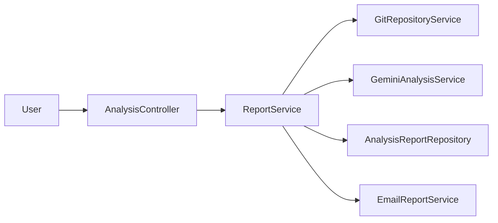

# System Architecture

## Main idea

The application uses a small layered structure so each responsibility remains easy to explain and test.

## Layers

- `web` contains the controller and global error handler.
- `service` contains interfaces.
- `service/impl` contains readable implementations.
- `repository` isolates in-memory report storage.
- `dto` contains form and analysis transfer records.
- `model` contains Git and report domain records.
- `config` reads and validates local `.env` settings.