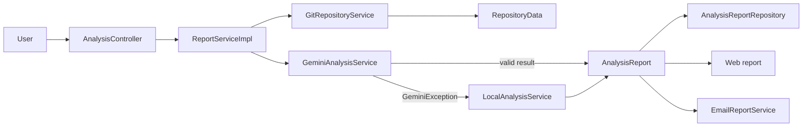
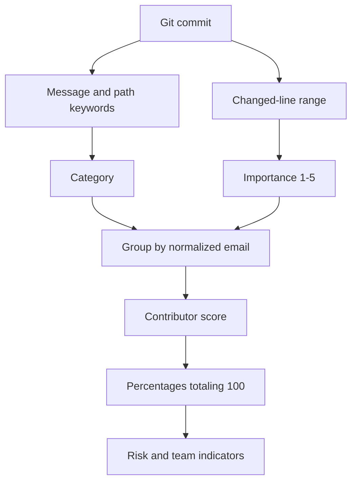

# System Architecture

## Main idea

The application separates Git data collection from contribution interpretation. Gemini is the primary analysis engine. A small deterministic analyzer provides a clearly labeled result only when Gemini cannot return a usable analysis.

## Package responsibilities

### `web`

- validates and receives the analysis form;
- redirects to completed reports;
- renders controlled error pages.

### `service` and `service/impl`

- `GitRepositoryServiceImpl` validates URLs, clones repositories, extracts commits, and removes temporary files;
- `GeminiPromptBuilder` converts the project goal and Git records into a controlled prompt;
- `GeminiAnalysisServiceImpl` calls Gemini and validates its structured response;
- `LocalCommitClassifier` applies deterministic commit categories and importance rules;
- `LocalAnalysisServiceImpl` groups commits, calculates local percentages, and creates indicators;
- `ReportServiceImpl` selects Gemini first and catches only `GeminiException` for fallback;
- `EmailReportServiceImpl` renders and sends the completed report.

### `repository`

`AnalysisReportRepository` separates report storage from orchestration. `InMemoryAnalysisReportRepository` keeps the app infrastructure-free.

### `dto` and `model`

DTO records represent form and analysis data. Model records represent Git facts, reports, and email-delivery state.

### `config`

`EnvFile` reads the local `.env` file. `AppSettings` applies defaults and converts values to the required types.

## Fallback analysis

The fallback activates only for `GeminiException`. This exception represents a missing key, API/network failure, empty or blocked output, invalid JSON, or an incomplete result.

The application does not catch every exception. Repository failures, invalid input, and programming errors remain visible through their normal error paths.

## Local algorithm

The local methodology is intentionally visible in the report. It is a continuity mechanism, not a replacement for semantic AI reasoning.

## Storage and Privacy

- cloned repositories exist only in temporary directories;
- reports are stored in a concurrent in-memory map;
- application restart removes all reports;
- `.env` secrets are kept outside Git;
- Thymeleaf escapes dynamic report content.