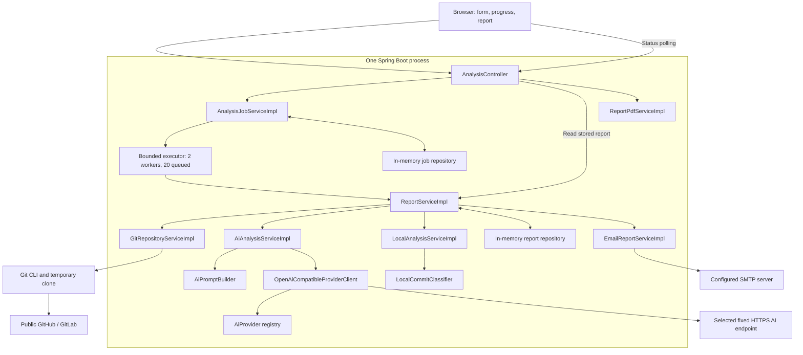

# System Architecture

This document describes the implementation of this project. Git Contribution AI is a single Spring Boot application with server-rendered pages, background analysis workers, and process-local storage. It turns a public repository's Git history and a user-supplied project goal into a browser report, an on-demand PDF, and an email copy.

See the [README](../README.md) for setup, usage, and current screenshots, and [AI_PROVIDERS.md](AI_PROVIDERS.md) for the configured provider/model catalog.

## Contents

- [Runtime and component boundaries](#runtime-and-component-boundaries)
- [Request and execution lifecycle](#request-and-execution-lifecycle)
- [Jobs and progress](#jobs-and-progress)
- [Git extraction](#git-extraction)
- [AI analysis and local fallback](#ai-analysis-and-local-fallback)
- [Data model and storage](#data-model-and-storage)
- [Browser interface](#browser-interface)
- [PDF and email delivery](#pdf-and-email-delivery)
- [Configuration](#configuration)
- [HTTP routes and failure handling](#http-routes-and-failure-handling)
- [Credentials and trust boundaries](#credentials-and-trust-boundaries)
- [Verification and design previews](#verification-and-design-previews)
- [Current limitations](#current-limitations)

## Runtime and component boundaries

The [Maven build](../pom.xml) targets **Java 21** and uses **Spring Boot 4.1.0**. Spring MVC serves Thymeleaf templates and static CSS/JavaScript from the same application. There is no separate frontend build, database, message broker, or external job runner.

Long-running analysis executes in a bounded `ThreadPoolTaskExecutor`. Git runs as an operating-system process; provider calls use Spring `RestClient` backed by the JDK HTTP client; email uses Spring Mail; PDF generation uses **OpenHTMLtoPDF 1.1.73** with its PDFBox backend.

The arrows below show calls and dependencies. `ReportServiceImpl` owns analysis orchestration, fallback selection, report persistence, and delivery ordering.



The production package is `mk.ukim.finki.gitcontributor`:

| Package | Responsibility |
|---|---|
| [web](../src/main/java/mk/ukim/finki/gitcontributor/web/) | Form, progress, status, report, and PDF routes; validation rendering; controller-local error responses. |
| [config](../src/main/java/mk/ukim/finki/gitcontributor/config/) | Validated operational settings and the bounded worker executor. |
| [service](../src/main/java/mk/ukim/finki/gitcontributor/service/) | Contracts for jobs, Git extraction, AI transport/analysis, fallback, reports, PDF, email, and progress callbacks. |
| [service/impl](../src/main/java/mk/ukim/finki/gitcontributor/service/impl/) | Implementations, prompt construction, and deterministic commit classification. |
| [dto](../src/main/java/mk/ukim/finki/gitcontributor/dto/) | Form input, public job status, and structured contribution-analysis records. |
| [model](../src/main/java/mk/ukim/finki/gitcontributor/model/) | Git facts, provider selection, immutable job/report records, and email outcomes. |
| [enums](../src/main/java/mk/ukim/finki/gitcontributor/enums/) | Provider catalog, failure taxonomy, job stages/states, analysis source, and report categories. |
| [repository](../src/main/java/mk/ukim/finki/gitcontributor/repository/) | Job/report repository interfaces and concurrent in-memory implementations. |
| [validation](../src/main/java/mk/ukim/finki/gitcontributor/validation/) | Server-side validation of exact provider/model selections. |
| [exception](../src/main/java/mk/ukim/finki/gitcontributor/exception/) | Controlled provider, repository, and missing-report errors. |

## Request and execution lifecycle

[AnalysisRequestDto](../src/main/java/mk/ukim/finki/gitcontributor/dto/AnalysisRequestDto.java) has five required fields:

| Field | Validation and purpose |
|---|---|
| `repositoryUrl` | At most 300 characters; HTTPS GitHub/GitLab URL. The Git service additionally validates the URI. |
| `projectDescription` | 20–2,000 characters; supplies the goal against which work is interpreted. |
| `aiModel` | At most 250 characters; an exact allowlisted `<provider>::<model>` value. |
| `aiKey` | At most 1,024 characters; leading/trailing whitespace is stripped, and embedded CR/LF characters are rejected. |
| `email` | A nonblank, valid recipient address, including when email delivery is disabled. |

A missing key or model is rejected before a job starts. The form offers no separate local-only mode.

1. `AnalysisController` validates `POST /analyze` and marks the response `Cache-Control: no-store`. Invalid input returns the form; the password input remains empty and requires re-entry.
2. `AnalysisJobServiceImpl` saves a queued job with its own UUID, then submits a task capturing the immutable request.
3. The controller redirects to `/analyses/{id}?newAnalysis=true`. A worker calls `ReportServiceImpl` while the browser polls status.
4. The report service parses the provider selection, extracts Git facts, and requests AI analysis. A controlled `AiProviderException` activates local fallback.
5. The service builds a report with a separate UUID, saves it with `EmailDelivery.PENDING`, and evaluates email delivery.
6. It saves the delivery outcome under the same report UUID. The worker then completes the job with the report ID and analysis source.
7. The browser finishes presenting the reached milestones and navigates to the report.

The save-before-delivery ordering is explicit:

```mermaid
sequenceDiagram
    participant B as Browser
    participant C as AnalysisController
    participant J as AnalysisJobService
    participant W as ReportService on worker
    participant S as Report repository
    participant E as EmailReportService

    B->>C: POST /analyze
    C->>J: Validate and queue request
    J-->>C: Job UUID
    C-->>B: Redirect to progress page
    J->>W: Run queued analysis
    Note over W: Extract Git facts; use AI or controlled local fallback
    W-->>J: Publish stage/source callbacks
    W->>S: Save report with PENDING delivery
    W->>E: Evaluate configuration and attempt email
    E-->>W: SENT, DISABLED, or FAILED
    W->>S: Save updated delivery outcome
    W-->>J: Return report; complete job
    B->>C: GET /api/analyses/{id}
    C->>J: Read job snapshot
    J-->>C: Completed status and report URL
    C-->>B: Status JSON
    B->>C: GET /reports/{reportId}
    C->>W: Read stored report
    W->>S: Find report by UUID
    S-->>W: AnalysisReport
    W-->>C: AnalysisReport
    C-->>B: Render report.html
```

Status polling also occurs while the worker runs. Saving a report does not complete the job: the normal redirect waits until the email outcome is recorded.

## Jobs and progress

[AnalysisTaskConfig](../src/main/java/mk/ukim/finki/gitcontributor/config/AnalysisTaskConfig.java) creates two workers, a queue capacity of 20, and `analysis-worker-` thread names. Saturation becomes a stored `FAILED` job with a queue-full message; the report service is not invoked for that rejected request. Shutdown does not wait for in-memory analysis work to finish.

[AnalysisJob](../src/main/java/mk/ukim/finki/gitcontributor/model/AnalysisJob.java) uses `QUEUED`, `RUNNING`, `COMPLETED`, and `FAILED` statuses. Stage advances are monotonic; repeated/backward advances and changes to terminal jobs are ignored. Failure retains the last reached stage and its progress. Completion requires a report ID.

[AnalysisStage](../src/main/java/mk/ukim/finki/gitcontributor/enums/AnalysisStage.java) defines these milestones:

| Stage | Progress | Meaning |
|---|---:|---|
| `QUEUED` | 0% | Waiting for a worker. |
| `STARTING` | 5% | Worker has started processing. |
| `READING_REPOSITORY` | 10% | Cloning and extracting Git facts. |
| `ANALYZING_WITH_AI` | 55% | Calling the selected provider and validating output. |
| `LOCAL_FALLBACK` | 70% | Running deterministic analysis after a controlled AI failure. |
| `PREPARING_REPORT` | 82% | Constructing the report record. |
| `SAVING_REPORT` | 88% | Saving the browser-accessible report. |
| `DELIVERING_EMAIL` | 94% | Checking configuration and attempting the email copy. |
| `COMPLETED` | 100% | Report and delivery outcome are recorded. |

These values identify stages, not measured fractions of elapsed time, clone bytes, or AI tokens. The delivery stage is entered even when sending is disabled; in that case the mail service returns `DISABLED` immediately. Completing that stage does not imply that email was sent.

[AnalysisJobStatusDto](../src/main/java/mk/ukim/finki/gitcontributor/dto/AnalysisJobStatusDto.java) exposes the job ID, repository label, status, stage/label, progress, selected analysis source, stage history, stage-state map, safe message, and report URL. It contains no request credentials or full analysis.

The server derives `PENDING`, `ACTIVE`, `COMPLETE`, and `SKIPPED` states. With `AI_PROVIDER`, local fallback is skipped. With `LOCAL_FALLBACK`, the AI stage is displayed as skipped even though the failed attempt remains in stage history. Job failure is represented by the job status and message; there is no separate `FAILED` stage-state enum value.

The browser polls with `fetch` and `cache: "no-store"`, scheduling the next poll one second after a successful status render. Connection errors show a reconnecting state and use exponential retry delays capped at eight seconds. A missing job or failed analysis stops polling. The `newAnalysis=true` presentation starts at zero and replays only milestones recorded by the server; it does not manufacture backend progress.

## Git extraction

[GitRepositoryServiceImpl](../src/main/java/mk/ukim/finki/gitcontributor/service/impl/GitRepositoryServiceImpl.java) validates the URI again at the service boundary. It accepts HTTPS URLs on `github.com` and `gitlab.com` with a repository path, rejecting embedded user information, query strings, and fragments.

Extraction runs in a temporary directory:

1. Perform a full `git clone --no-checkout`, with low-speed limits and a per-command timeout.
2. Read `origin/HEAD` as default-branch metadata, using `unknown` if that lookup fails.
3. Select at most `maxCommits` commits using `git log --all --max-count=...`.
4. Collect full hashes, author names/emails, author timestamps, messages, changed-file addition/deletion counts, and diffs.
5. Truncate each diff to `maxDiffChars`, appending a truncation notice when needed.
6. Return `RepositoryData` and attempt to delete the temporary clone in a `finally` block.

The commit sample can include other fetched refs; the displayed default branch does not restrict selection. A smaller commit limit does not make the clone shallow. Diff truncation occurs after Git output has been read, so it limits retained/provider input rather than clone size or peak Git-output size.

Commands use argument lists through `ProcessBuilder`. Output is redirected to temporary files to avoid blocked process pipes. Timeout and interruption terminate the Git process tree; interrupted threads retain their interrupt flag. Clone and output-file cleanup is best effort, so filesystem failures can leave temporary artifacts. Empty history or unreadable Git data fails the job.

## AI analysis and local fallback

### Provider registry and transport

[AiProvider](../src/main/java/mk/ukim/finki/gitcontributor/enums/AiProvider.java) owns **66 configured model choices across 11 provider namespaces**: Google Gemini, OpenAI, Anthropic Claude, OpenRouter, xAI, DeepSeek, Mistral AI, Groq, Together AI, Hugging Face, and Cerebras. The 2026-09-07 catalog expansion brings OpenAI to 11 choices and Anthropic Claude to 11; exact IDs and lifecycle references are listed in [AI_PROVIDERS.md](AI_PROVIDERS.md).

[AiProviderSelection](../src/main/java/mk/ukim/finki/gitcontributor/model/AiProviderSelection.java) splits on the first `::`, preserves the complete remaining model value, and validates the pair against the registry. Browser key-prefix hints do not select a provider. The registry supplies the destination HTTPS endpoint; users cannot enter an arbitrary AI URL.

[OpenAiCompatibleProviderClient](../src/main/java/mk/ukim/finki/gitcontributor/service/impl/OpenAiCompatibleProviderClient.java) makes one Chat Completions request using the submitted key:

```json
{
  "model": "<exact allowlisted model>",
  "messages": [
    {"role": "user", "content": "<analysis prompt>"}
  ],
  "stream": false
}
```

The reusable client stores no API key. It sets the Bearer authorization header for that request, uses a 20-second connection timeout and configured AI read timeout, refuses redirects, and reads at most **2 MiB** of response data. It accepts string content or arrays of text parts and maps explicit refusal output to a blocked response.

Non-success HTTP responses become stable failure reasons without exposing their bodies. The application adds no streaming, automatic retry, provider switching, or provider-specific `response_format` option. Live model access remains the provider account's responsibility; the allowlist describes application configuration.

### Prompt and result validation

[AiPromptBuilder](../src/main/java/mk/ukim/finki/gitcontributor/service/impl/AiPromptBuilder.java) combines the project description with serialized `RepositoryData`. It marks repository text and the description as untrusted input, requests English explanations and one JSON object, and derives allowed enum names from the code.

[AiAnalysisServiceImpl](../src/main/java/mk/ukim/finki/gitcontributor/service/impl/AiAnalysisServiceImpl.java) removes supported Markdown fences or surrounding prose, deserializes to `ContributionAnalysisDto`, and validates both nested fields and cross-record invariants:

- Every selected commit hash occurs exactly once; no missing, duplicate, or extra hashes are accepted.
- Contributor percentages are integers in 0–100 and total exactly 100.
- Contribution levels match the share: `HIGH` at 25–100%, `MEDIUM` at 15–24%, and `LOW` at 0–14%.
- Each contributor's category-summary counts exactly match their analyzed commits, without duplicate category entries.
- Required text, list elements, enum values, hashes, and 1–5 importance scores satisfy Jakarta Validation.

These checks validate structure and consistency; they do not establish that the model's interpretation or contributor attribution is correct. `ContributionAnalysisDto` sorts contributors by descending share, then name and email to resolve ties.

### Controlled fallback

Authentication failures, unavailable models, quotas/rate limits, timeouts, network/provider errors, blocked or empty output, and invalid results become `AiProviderException` with an `AiFailureReason` and category. `ReportServiceImpl` catches that boundary, logs the provider namespace/category/reason, and invokes [LocalAnalysisServiceImpl](../src/main/java/mk/ukim/finki/gitcontributor/service/impl/LocalAnalysisServiceImpl.java). Repository errors and unexpected runtime failures follow the failed-job path.

The fallback uses [LocalCommitClassifier](../src/main/java/mk/ukim/finki/gitcontributor/service/impl/LocalCommitClassifier.java) to classify messages and paths into Functional, Bug Fix, Refactoring, Documentation, Formatting, Testing, Configuration, or Other. It assigns importance from changed-line ranges, applies project-keyword adjustments and category caps, and groups work by trimmed, case-normalized author email.

Contributor scores are sums of commit importance. Whole-number shares use largest remainders to total exactly 100, and the analyzer generates category summaries, risk flags, and team indicators. The result identifies `LOCAL_FALLBACK`, the built-in heuristic engine, a safe provider-failure notice, and the local methodology. It provides an availability path without semantic AI interpretation.

## Data model and storage

| Record | Contents and lifetime |
|---|---|
| `AnalysisRequest` | User inputs, including the AI key; held by the request and queued/running task, not persisted in a repository. |
| `RepositoryData`, `GitCommit`, `ChangedFile` | Extracted metadata, file statistics, and bounded diffs; used during analysis. |
| `ContributionAnalysis` and nested DTOs | Summary, goal alignment, contributors, categories, commit evidence, risk flags, team indicators, conclusion, and methodology. |
| `AnalysisJob` | Immutable processing snapshot, stage history, source, timestamps, safe error, and report reference. |
| `AnalysisReport` | Repository metadata, project goal, recipient email, source/engine/notice, analyzed commit count, generation time, structured analysis, and `EmailDelivery`. |

[InMemoryAnalysisJobRepository](../src/main/java/mk/ukim/finki/gitcontributor/repository/InMemoryAnalysisJobRepository.java) uses a `ConcurrentHashMap` and atomic `computeIfPresent` updates. It targets **200 retained jobs**, evicting the oldest terminal jobs by update time. Active jobs are not evicted, so 200 is a retention target rather than an unconditional hard cap.

[InMemoryAnalysisReportRepository](../src/main/java/mk/ukim/finki/gitcontributor/repository/InMemoryAnalysisReportRepository.java) is a separate concurrent map. Updating email delivery replaces the report record under its existing UUID. Reports have no count limit, time-based expiry, or cascade deletion when a job is evicted.

All stored records are shared by the running application, not scoped to a browser session. Restart loses jobs and reports. Raw diffs and AI keys are not fields of stored reports, but contributor identities, commit messages/analysis, the project goal, and recipient email are retained.

## Browser interface

The redesigned UI remains server-rendered. [Templates](../src/main/resources/templates/) and [static assets](../src/main/resources/static/) separate presentation from the Java analysis services:

| View or asset | Responsibility |
|---|---|
| `index.html` | Landing page and five-field form; model groups, provider hints, visible validation, masked key, and submission feedback. |
| `analysis-progress.html` + `analysis-progress.css` | Dedicated progress layout with an SVG ring, repository/status row, nine-stage pipeline, reconnecting/failure states, and completion presentation. |
| `report.html` | Repository metadata, source/delivery notices, contribution chart, contributor cards, category bars, commit evidence, team indicators, assessment, and PDF actions. |
| `fragments/report.html` | Reusable commit-evidence rows for browser contributor cards. |
| `fragments/browser.html` + `style.css` | Shared browser head/brand/assets and styles for the home, report, and error pages. |
| `app.js` | Form interactions, provider-aware key clearing, page/reveal animations, progress polling/replay, and report navigation. |
| `error-page.html` | Controlled browser error presentation. |

The model selector is declared in the HTML and checked against the backend registry by tests. Switching providers clears the key; switching models within the same provider preserves it.

Contributor/category charts use HTML/CSS rather than a charting library. Contributor cards show up to four featured commits for high contribution and three for other levels; normal reports expose remaining commits through an additional disclosure. The PDF includes every analyzed commit. Category bars represent commit counts within that contributor, while the overview shows estimated contribution shares.

The UI uses accessible progress/live-region attributes and native disclosure controls. CSS and JavaScript honor reduced-motion preferences. Bootstrap Icons load from jsDelivr; the dedicated progress page also loads Inter and JetBrains Mono from Google Fonts. These browser assets are separate from AI-provider traffic.

See [the README gallery](../README.md#screens) for current screenshots captured with example inputs and synthetic preview data.

## PDF and email delivery

### PDF

[ReportPdfServiceImpl](../src/main/java/mk/ukim/finki/gitcontributor/service/impl/ReportPdfServiceImpl.java) renders the dedicated [report-pdf.html](../src/main/resources/templates/report-pdf.html) template from a stored `AnalysisReport`. It uses English formatting, an A4 layout, and an embedded Liberation Sans font loaded from the PDFBox dependency to support Cyrillic text.

PDF bytes are generated on each request and returned directly; they are not cached in the report repository or saved as a server-side export file. `Open PDF` requests inline display in a new tab, and `Download PDF` requests attachment delivery. Responses use `application/pdf`, a sanitized filename, `Cache-Control: no-store`, and `X-Content-Type-Options: nosniff`. PDF generation does not rerun Git or AI analysis.

### Email

[EmailReportServiceImpl](../src/main/java/mk/ukim/finki/gitcontributor/service/impl/EmailReportServiceImpl.java) uses Spring-managed `MailProperties` and `JavaMailSender`. The operator configures the sender's SMTP account; the form supplies the recipient.

The service renders [email-report.html](../src/main/resources/templates/email-report.html) as an HTML message body and attaches the same HTML as a report file. It does **not** attach the PDF.

| Delivery status | Transition |
|---|---|
| `PENDING` | Initial report save, before delivery is evaluated. |
| `DISABLED` | `app.mail-enabled` is false. |
| `FAILED` | Required SMTP settings are missing, the send fails, or the orchestration layer catches an unexpected delivery exception. |
| `SENT` | `JavaMailSender.send(...)` returns successfully. |

Email is attempted on the analysis worker after the first report save. SMTP timeouts can therefore hold the job at 94%. A disabled or failed send still produces a completed job and an accessible browser/PDF report. `SENT` records the SMTP operation's outcome, not guaranteed inbox placement. There is no delivery retry queue or automatic resend when configuration changes.

## Configuration

[application.properties](../src/main/resources/application.properties) imports an optional `.env` from the application's **working directory**:

```properties
spring.config.import=optional:file:.env[.properties]
```

[.env.example](../.env.example) is the shareable template; the real `.env` is Git-ignored. The file uses Java properties syntax (`KEY=value`, without shell `export` or surrounding quotes). The app can start without the file.

[AppSettings](../src/main/java/mk/ukim/finki/gitcontributor/config/AppSettings.java) binds six values under `app`; Jakarta Validation checks the numeric ranges during startup:

| Environment variable | Application property | Default | Constraint or behavior |
|---|---|---|---|
| `MAX_COMMITS` | `app.max-commits` | 80 | 1–200 commits. |
| `MAX_DIFF_CHARS` | `app.max-diff-chars` | 6,000 | 500–20,000 characters per diff, before the truncation notice. |
| `GIT_TIMEOUT_SECONDS` | `app.git-timeout-seconds` | 120 | 20–600 seconds per Git command. |
| `AI_TIMEOUT_SECONDS` | `app.ai-timeout-seconds` | 180 | 30–600 seconds for the provider read timeout. |
| `MAIL_ENABLED` | `app.mail-enabled` | `true` | Email enabled by default; `false` explicitly disables it. |
| `MAIL_FROM` | `app.mail-from` | Empty | Falls back to `MAIL_USERNAME` when blank. |

Spring Mail separately binds `MAIL_HOST` (default `smtp.gmail.com`), `MAIL_PORT` (587), `MAIL_USERNAME`, and `MAIL_PASSWORD` (both empty). Sending requires a host, username, password, and sender address. Defaults enable SMTP authentication and STARTTLS, select UTF-8, and set connection/read/write timeouts to **10 seconds each**.

For these environment-backed values, process environment variables override `.env`, which overrides application defaults. Standard Spring property overrides also apply. Restart is required to apply configuration edits.

AI keys and selected models are supplied per analysis and have no `AppSettings` bindings. Enabling mail without credentials produces a `FAILED` delivery outcome for the report; it does not prevent application startup or report creation.

## HTTP routes and failure handling

All production routes belong to [AnalysisController](../src/main/java/mk/ukim/finki/gitcontributor/web/AnalysisController.java).

| Method | Path | Behavior |
|---|---|---|
| `GET` | `/` | Render an empty analysis form. |
| `POST` | `/analyze` | Validate and queue; redirect to progress, or redisplay invalid input. |
| `GET` | `/analyses/{id}` | Render a job's progress; `newAnalysis=true` enables replay from zero. |
| `GET` | `/api/analyses/{id}` | Return public status JSON and the report URL after completion. |
| `GET` | `/reports/{id}` | Render the stored report; `newReport=true` controls arrival presentation. |
| `GET` | `/reports/{id}/pdf` | Generate an inline PDF; `download=true` changes the disposition to attachment. |

Job and report identifiers are UUIDs. The status endpoint exposes `/reports/{reportId}?newReport=true` only once the job contains a report reference.

| Failure boundary | Result |
|---|---|
| Form validation | Redisplay field errors and require the key again; no job starts. |
| Full worker queue | Stored failed job with a safe retry message. |
| Git extraction or unexpected analysis error | Failed job with a safe repository/general message; internal details stay out of status JSON. |
| Controlled AI failure | Local fallback report, with its source and reason visible. |
| Missing SMTP configuration or send failure | Report retained, delivery marked failed, job completed. |
| Missing job/report | Controlled 404 response; JSON for status/PDF, HTML for browser pages. |
| PDF rendering error | JSON error with HTTP 500; the stored report remains available. |

Malformed route values are handled locally: the status API returns 404, while invalid browser/PDF route values return 400. Normal form POST, status JSON, and PDF responses set `no-store`; that policy is not applied globally to every page or error-handler response. Server error configuration excludes automatic exception messages and stack traces from responses.

## Credentials and trust boundaries

The AI key exists in form/request memory and the queued/running task, then flows directly through the report service, AI analysis service, and provider client. `AnalysisRequestDto.toString()` redacts the key and project description. No job, public status, stored report, PDF, or email record contains an API-key field; the browser does not save the key in local/session storage or repopulate it after server validation fails.

The worker task releases its request reference after execution or rejection; there is no credential repository. Java strings cannot be reliably zeroed, so this minimizes application-held references rather than guaranteeing memory erasure.

The selected provider receives the project goal and extracted Git facts, including contributor identities and bounded diffs. Fixed destinations and disabled redirects constrain where the Bearer key is sent. Controlled provider failures log only stable metadata; raw provider bodies and authorization headers are not logged by that path.

Thymeleaf escapes dynamic report text, and the prompt explicitly treats repository content as untrusted data. SMTP credentials remain operational configuration rather than analysis input. There is **no sign-in or per-user report authorization**: someone with server access and a report URL can read the report. UUIDs identify records; they do not provide an ownership check.

## Verification and design previews

Tests in [src/test](../src/test/) exercise the architectural boundaries: request/provider validation, Git extraction and process termination, transport failure mapping, AI-result invariants, deterministic scoring, worker capacity and stage history, report preservation across mail failure, controller responses, and readable PDF output.

[MailConfigurationTest](../src/test/java/mk/ukim/finki/gitcontributor/config/MailConfigurationTest.java) covers startup without `.env`, default-on email, SMTP binding from `.env`, explicit disabling, and process-environment precedence. Tests use mocks, temporary fixtures, and synthetic data rather than sending email or calling live providers.

```bash
mvn test
```

[DesignPreviewController](../src/test/java/mk/ukim/finki/gitcontributor/web/DesignPreviewController.java) lives on the **test classpath** and requires the `test` profile. Start it with:

```bash
mvn spring-boot:test-run -Dspring-boot.run.profiles=test
```

Its `/__preview/progress`, `/__preview/report`, `/__preview/report/pdf`, `/__preview/report-scale`, `/__preview/report-scale/pdf`, and `/__preview/error` routes render synthetic states through the real templates/services. Progress accepts stage/source options, and `design-preview.js` supplies preview behavior without live status polling. The report preview deliberately includes a failed-email example.

These controllers are absent from the packaged application. Activating the test profile alone does not add test classes to the production JAR. Submitting the normal form while running previews still starts a real analysis. The [README preview section](../README.md#local-design-previews) provides direct example URLs.

## Current limitations

- Jobs, reports, and queued work are process-local; there is no durable recovery, cross-instance coordination, cancellation endpoint, or persistent report store.
- Job retention does not bound the report repository. Repeated analyses can grow memory use until restart.
- Full clones and per-command timeouts do not impose a total repository-size or whole-job deadline.
- Only public GitHub/GitLab repositories are supported through the form. There is no private-repository credential flow or branch selector.
- The fixed provider/model registry cannot represent arbitrary endpoints, local AI servers, Azure deployment metadata, or cloud IAM/region/project credentials.
- Provider availability, account access, quota, cost, and model behavior can change independently of the configured catalog.
- Contributor identity is based on Git author information, and the selected history omits work done outside Git. Structural validation and deterministic fallback do not remove the need for human interpretation.