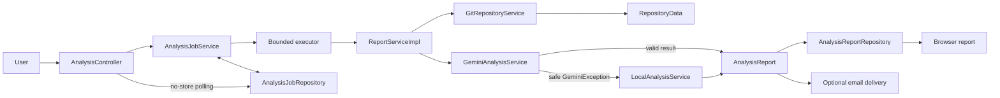
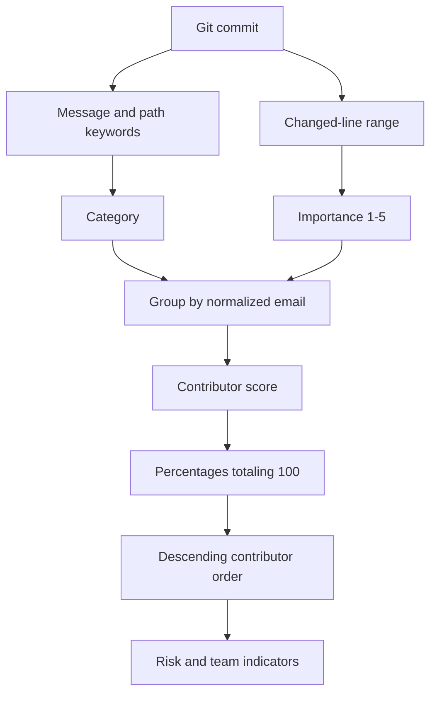
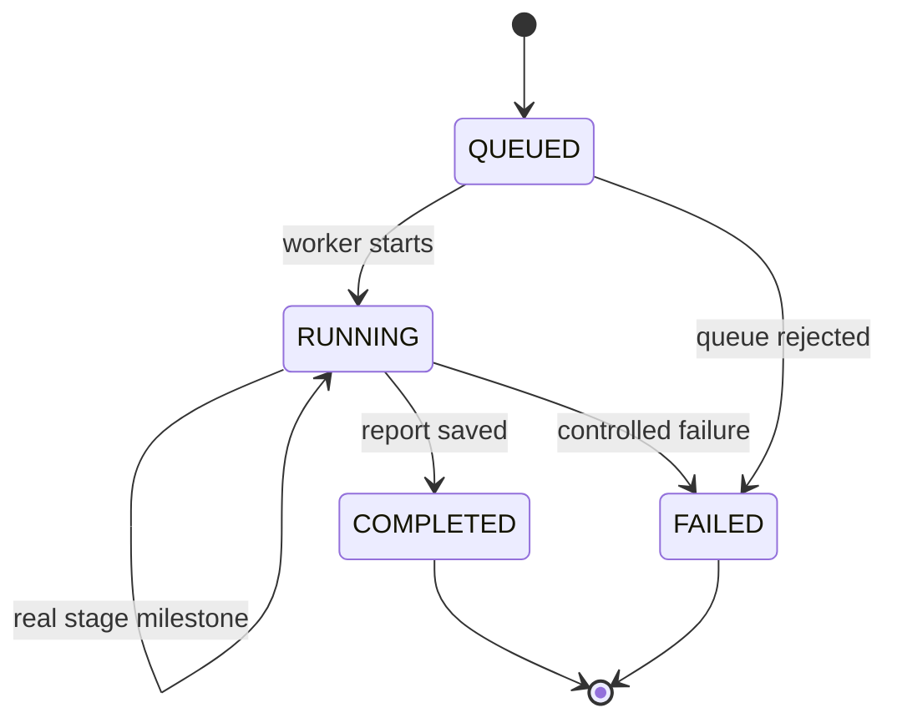

# System Architecture

## Main idea

The application separates request handling, background execution, Git data collection, contribution interpretation, report storage, and optional delivery. Gemini is the primary analysis engine. A deterministic analyzer provides a clearly labeled fallback when Gemini cannot return a usable analysis. The completed report is always prepared for the browser; email is an optional second delivery channel.

The POST request returns quickly with an analysis URL. A worker performs the long-running operation, while the browser polls a small status endpoint and renders real server milestones from 0% to 100%.

## Package responsibilities

### `web`

- validates and receives the analysis form;
- redirects to the analysis progress URL;
- returns a privacy-safe, non-cacheable job status response;
- redirects completed jobs to their stored browser report;
- renders controlled error pages.

### `service` and `service/impl`

- `AnalysisJobServiceImpl` copies the mutable request, submits it to the bounded executor, advances its lifecycle, and converts internal failures to safe browser messages;
- `GitRepositoryServiceImpl` validates URLs, performs a complete clone, extracts commits and changed-file objects, and removes temporary files;
- `GeminiPromptBuilder` converts the project goal and Git records into a controlled prompt;
- `GeminiAnalysisServiceImpl` calls Gemini, validates its structured response, and maps provider failures to stable internal reasons;
- `LocalCommitClassifier` applies deterministic commit categories and importance rules;
- `LocalAnalysisServiceImpl` groups commits, calculates local percentages, and creates indicators;
- `ReportServiceImpl` selects Gemini first, catches only `GeminiException` for fallback, saves the report for the browser, and then attempts optional email delivery;
- `EmailReportServiceImpl` renders and sends the completed report when SMTP delivery is enabled.

### `repository`

- `AnalysisJobRepository` separates job lifecycle storage from background execution;
- `AnalysisReportRepository` separates completed report storage from orchestration;
- the in-memory implementations use concurrent maps and keep the student version infrastructure-free;
- the job registry keeps up to 200 recent records by evicting the oldest terminal jobs, while completed reports remain in their separate process-local repository.

### `enums`

All nine closed domains are centralized in `mk.ukim.finki.gitcontributor.enums`:

| Type | Architectural role |
|---|---|
| `AnalysisJobStatusDto` | lifecycle state: queued, running, completed, or failed |
| `AnalysisSource` | Gemini or local-fallback report origin; `displayName()` adapts it for presentation |
| `AnalysisStage` | server progress milestone plus `progress()`, `label()`, and `message()` metadata |
| `CommitCategory` | finite commit/category-summary classification taxonomy |
| `ContributionLevel` | low/medium/high domain; `fromPercentage(int)` owns the 20/40 thresholds and 0–100 guard |
| `EmailDeliveryStatus` | pending/disabled/sent/failed delivery state; `cssClass()` adapts it for styling |
| `GeminiFailureCategory` | stable high-level provider/configuration failure grouping |
| `GeminiFailureReason` | concrete safe failure reason; `category()` and `userMessage()` expose controlled metadata |
| `TeamIndicatorSeverity` | info/warning/critical severity; `cssClass()` adapts it for styling |

An enum is used only where the allowed set is closed. `TeamIndicatorDto.type`, explanatory text, stage labels, and provider model names remain strings because they are open or presentational domains.

### `dto` and `model`

- DTO records represent form data, analysis data, and the public job status;
- `ContributionAnalysisDto` establishes one canonical contributor order: contribution percentage descending, then name and email for deterministic ties;
- `CategorySummaryDto.category` and `CommitAnalysisDto.category` use `CommitCategory`;
- `ContributorAnalysisDto.contributionLevel` uses `ContributionLevel`, and `TeamIndicatorDto.severity` uses `TeamIndicatorSeverity`;
- `AnalysisJobStatusDto.status`/`.stage` use `AnalysisJobStatusDto`/`AnalysisStage`; `from(AnalysisJob)` passes the types directly while deriving the safe message, stage label, and report URL;
- model records represent Git facts, reports, email-delivery state, and jobs; `AnalysisReport.analysisSource`, `EmailDelivery.status`, and `AnalysisJob.status`/`.stage` are typed with enums.

### `config`

- `EnvFile` reads the local `.env` file;
- `AppSettings` applies defaults and converts values to the required types;
- `AnalysisTaskConfig` supplies a dedicated executor with 2 workers and a queue capacity of 20 jobs; in-memory work is not kept alive when that executor is destroyed.

## Reliable Git extraction

The changed-file analysis needs commit, tree, and blob objects. A partial clone can advertise a commit in Git's commit graph while the required object is absent locally, producing errors such as “in the commit graph file but not in the object database.” The application therefore performs a complete clone instead of using `--filter=blob:none`. Processing limits still constrain the amount of history and diff text sent for analysis; they do not deliberately omit objects needed to read the selected commits.

Temporary clones are removed after extraction, including failed attempts. A Git timeout or worker interruption force-stops the root process and its snapshotted descendants so helpers such as `git-remote-https` do not continue after the in-memory job has ended.

## Gemini boundary and safe fallback diagnostics

Fallback activates only for `GeminiException`. Stable reasons distinguish configuration, request, authentication, capacity, connectivity, provider, and response failures. Examples include a missing key or model, rejected credentials, an unavailable model, quota limits, timeouts, network failures, blocked output, and invalid structured output.

HTTP status codes and transport failures are mapped to `GeminiFailureReason`. Structured responses are validated through nested contributor, category, commit, and team-indicator fields. `GeminiPromptBuilder.build(...)` derives the documented category/level/severity allowlists from enum `values()` through `enumNames(...)`, so the prompt and Java types cannot drift independently.

`GeminiAnalysisServiceImpl.parseResponse(...)` maps an unknown enum name to the controlled `INVALID_RESPONSE` reason. `validateResponse(...)` checks non-null typed fields and verifies that `ContributionLevel.fromPercentage(...)` matches each percentage. `isInvalidCategorySummary(...)` and `isInvalidTeamIndicator(...)` therefore need no manually duplicated string sets. Malformed nested output becomes `INVALID_RESPONSE` instead of reaching the report template. The browser report receives only the corresponding safe explanation. Provider response bodies, API keys, raw exception messages, filesystem paths, and Git process output are not exposed. Detailed causes remain in server logs where appropriate.

Repository failures, invalid form input, and programming errors do not silently become local contribution reports. They follow their own controlled error paths.

## Local algorithm and contributor ranking

The canonical DTO constructor sorts every valid result, regardless of whether it came from Gemini or the local analyzer. The highest estimated contribution therefore appears first in both browser and email views. Equal percentages use case-insensitive name and email ordering, which keeps output deterministic.

`LocalCommitClassifier.analyze(...)`, `classify(...)`, and `calculateImportance(...)` use `CommitCategory` throughout. `LocalAnalysisServiceImpl.toContributorAnalysis(...)` aggregates `Map<CommitCategory, Integer>` and calls `ContributionLevel.fromPercentage(...)`; `createTeamIndicators(...)` returns typed `TeamIndicatorSeverity` values. The local and Gemini paths therefore converge on the same typed DTO boundary.

The local methodology remains visible in the report. It is a continuity mechanism, not a replacement for semantic AI reasoning.

## Background job and progress lifecycle

Progress is stage-based, not timer-based: queued (0%), starting (5%), reading Git history (10%), Gemini analysis (55%), optional local fallback (70%), report preparation (82%), report saving (88%), optional email delivery (94%), and completed (100%). A slow clone can legitimately remain at 10%; the percentage never claims work that the server has not reached.

The status endpoint uses `Cache-Control: no-store`. Client polling uses chained requests, so requests do not overlap, and applies limited backoff after transient failures. Refreshing the progress page is safe because the job state is server-side. Email status `DISABLED` or `FAILED` does not change a successfully stored report into a failed analysis.

`AnalysisJob.queued(...)`, `advanceTo(...)`, `complete(...)`, `fail(...)`, and `isTerminal()` enforce the typed `AnalysisJobStatusDto`/`AnalysisStage` transitions. `AnalysisJobServiceImpl.updateStage(...)` and `AnalysisProgressListener.onStage(...)` pass `AnalysisStage` rather than free-form strings. `ReportServiceImpl.createReport(...)` reports those stages and uses typed `AnalysisSource`/`EmailDeliveryStatus`; `EmailReportServiceImpl.sendReport(...)` returns a typed delivery result.

The polling client changes its progress text and ARIA value only when the corresponding server value changes, avoiding repeated live-region announcements for an unchanged stage. Missing or malformed analysis identifiers receive controlled responses instead of entering an endless retry loop.

The job registry keeps up to 200 recent records. If queued/running entries temporarily occupy the limit, the next terminal transition triggers cleanup; the oldest terminal records are evicted first. On executor destruction, queued work is cancelled and running in-memory work is interrupted because neither jobs nor reports can survive the application process. An interrupted Git operation also terminates its external process tree before the worker restores its interrupt flag.

## JSON, template, CSS, and JavaScript compatibility

The refactor changes Java types without renaming API fields or endpoints. Jackson serializes enums with `name()` by default, so the job status response still contains uppercase values such as `"status":"COMPLETED"` and `"stage":"COMPLETED"`. The polling client continues to compare `job.status` with `"COMPLETED"` and `"FAILED"`; its redirect, retry, progress-bar, and ARIA behavior is unchanged.

Gemini structured JSON intentionally uses the enum names `HIGH|MEDIUM|LOW`, all `CommitCategory` names, and `INFO|WARNING|CRITICAL`. The prompt requests those exact uppercase values, and unsupported input fails at the controlled parsing boundary.

Presentation adapters keep internal names out of user-facing styling and labels:

- `AnalysisSource.displayName()` supplies “Gemini AI” or “Local fallback” to browser and email templates;
- `ContributionLevel.displayName()` supplies “High”, “Medium”, or “Low” to the report;
- `EmailDeliveryStatus.cssClass()` supplies `pending`, `disabled`, `sent`, or `failed`;
- `TeamIndicatorSeverity.cssClass()` supplies `info`, `warning`, or `critical`.

Consequently, `report.html` and `email-report.html` preserve their visible output and CSS contract while consuming typed records.

## Storage, privacy, and security

- cloned repositories exist only in temporary directories;
- jobs and reports are stored in separate concurrent in-memory maps;
- the progress/job registry is count-bounded to 200 recent records, but the report repository has no expiry in this student version;
- an application restart removes all jobs and reports;
- the status DTO excludes repository URL, project description, recipient email, provider output, and exception details;
- `.env` secrets stay outside Git and must never be copied into documentation or logs;
- dynamic report content is escaped by Thymeleaf;
- only public repository URLs are accepted by the current implementation;
- the bounded executor prevents unbounded task and thread growth.

## Current limitations and extension points

- in-memory jobs and reports are suitable for one application instance only, and completed reports currently accumulate until restart;
- progress represents coarse server stages, not byte-level clone or token-level Gemini completion;
- public repositories only; private repositories need an authentication design;
- one email can represent several identities, and one person can use several emails;
- Gemini output is nondeterministic and can be limited by quota, safety rules, or availability;
- local keyword and line-count rules can misclassify work;
- future work includes database persistence, time-based job expiry, persistent-report cleanup, distributed queues, rate limiting, authentication, contributor identity merging, PDF export, and period-to-period comparisons.